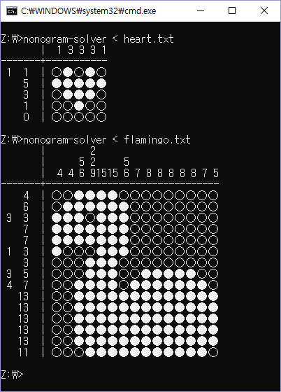
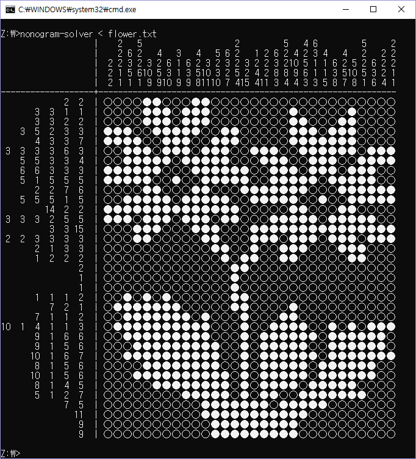

# Nonogram-Solver

심심해서 만들어본 [노노그램](https://ko.wikipedia.org/wiki/%EB%85%B8%EB%85%B8%EA%B7%B8%EB%9E%A8)(네모네모로직) 풀이 프로그램.

---

Input Example :
```
5 5

2 1 1
1 5
1 3
1 1
1 0

1 1
1 3
1 3
1 3
1 1
```

Result :





---

TODO :
- 너무 큰 맵에 비해 힌트가 별로 없으면, 재귀 호출을 필요 이상으로 함.
- 힌트를 정렬하거나 짧은 힌트는 넘기도록 수정할 것.
